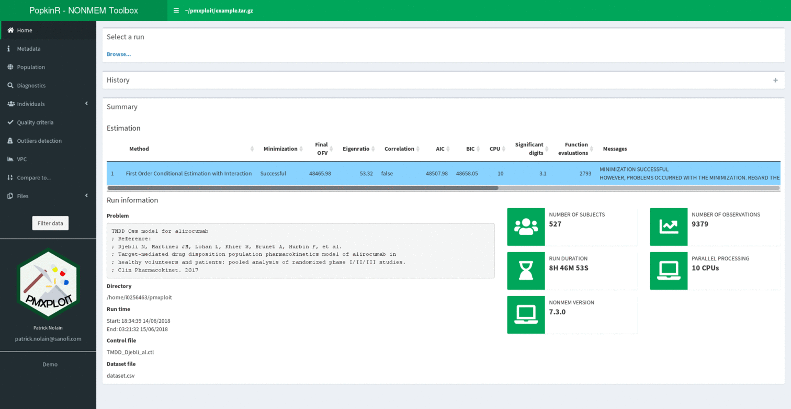

<!-- README.md is generated from README.Rmd. Please edit that file -->

popkinr
=======

PopkinR is an R package aiming at facilitating the development of non-linear mixed effects models with NONMEM.

It contains interactive web-applications based on `shiny` for:

-   Post-processing of NONMEM runs results (`PMXploit`)
-   Launch of NONMEM runs and editing control files (`PMXecute`)
-   Exploration of NONMEM-like datasets (`PMXplore`)

PMXploit `popkinr::nonmem_toolbox`
----------------------------------

Together with the [**pmxploit**](https://github.com/pnolain/pmxploit) package, brings interactivity to NONMEM runs post-processing analysis.

Dynamically generates corresponding R-code to most of the plots and tables provided by the application so it can be embedded in any R script.

PMXecute `popkinr::nonmem_monitor`
----------------------------------

....

PMXplore `popkinr::dataset_exploration`
---------------------------------------

....

Installation
============

Packages dependencies
---------------------

...

System requirements
-------------------

...
